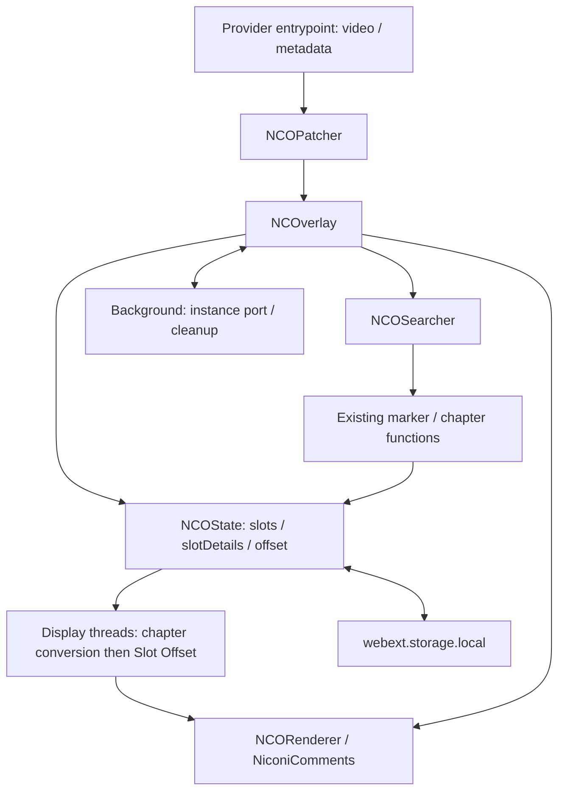

# Timeline Sync architecture investigation — Phase 0

調査日: 2026-10-03 (Asia/Tokyo)。対象: NCOverlay **3.40.3**。
基準 commit: **`76fca164ab6c28bb37866bf3c839ac6f431c682d`**。
`origin`: `https://github.com/folhym/NCOverlay.git`、`upstream`: `https://github.com/Midra429/NCOverlay.git`。
作業 branch: `docs/timeline-sync-architecture`。

Phase 0 の成果物は本書と root の `AGENTS.md`。既存ソース、UI、設定、依存、lockfile の変更や Phase 1 以降の実装は行わない。
以下の「確認済み」はコードの読取りを意味する。Netflix / Prime Video のログイン再生、現行 DOM / API、広告、ユーザー報告の再現は実機未確認。
行番号は上記 commit に対応する。末尾の固定 SHA のリンクから独立して照合できる。

## 1. 現行 NCOverlay アーキテクチャ

| 層 | 主なファイル・行 | 責務 |
| --- | --- | --- |
| 拡張構成 | `wxt.config.ts`、`package.json` | WXT / TypeScript / React、Manifest V3、Chrome / Firefox 向け build |
| VOD entrypoint | `src/entrypoints/vod-*.content/index.ts` | 有効設定、video 取得、Provider metadata、canvas 挿入、DOM lifecycle |
| Patcher | `src/ncoverlay/patcher.ts:15–35,71–92` | `getInfo` / `appendCanvas` / 任意の `autoSearch` を注入し、video ごとに NCOverlay を生成 |
| NCOverlay | `src/ncoverlay/index.ts:58–81,159–163,169–214` | State / Searcher / Renderer / Keyboard、video イベントと storage / messaging を接続 |
| State | `src/ncoverlay/state.ts:203–450,453–596` | タブの state 管理、slot の表示用 thread 生成・変換 |
| Searcher | `src/ncoverlay/searcher.ts:392–416` | 検索・コメント取得、実況 marker / chapter の結果を slot に保存 |
| Renderer | `src/ncoverlay/renderer.ts:45–54,143–190` | canvas と NiconiComments、media 時刻と Global Offset による描画 |
| Storage | `src/utils/storage/extension.ts:10–35` | `webext.storage.local`、null / undefined 保存はキー削除 |
| Background | `src/entrypoints/background/index.ts:30–31,67–131` | API proxy、instance port、heartbeat と終了時 state cleanup |



独立した video interface や episode identity はない。HTMLVideoElement が基本 abstraction で、`NCOPatcherFunctions.getCurrentTime` のみ差替え可能。
Renderer は既定で `video.currentTime` を読む。Netflix / Prime はこの override を使用しない。paused / playbackRate / DOM event は video に依存する。
描画時には毎 frame video 時刻を読むのではなく、`updateTime()` 時点を基準に `performance.now()` と playbackRate で補間する。
`playing` / `seeked` / `ratechange` 等で再基準化し、`drawCanvas(vpos)` に centisecond 単位の時刻を渡す。

## 2. Offset 処理

### 2.1 保存と適用順

| 項目 | 単位 / 保存先 | 根拠 |
| --- | --- | --- |
| Global Offset | 秒、`state:${tabId}:offset` | `GlobalOffsetControl.tsx:12–25`、`state.ts:36,468,493–494` |
| Slot Offset | ms、`state:${tabId}:slotDetails` 内 `offsetMs` | `SlotItem/Options.tsx:48–65`、`state.ts:88,359` |
| 自動実況 chapter 補正 | raw comment の `vposMs` を変換 | `state.ts:255–288` |
| Renderer の Global 適用 | `max((videoSeconds - offsetSeconds) * 100, 0)` | `renderer.ts:118–146` |

通常区間の比較式は次のとおり。Global と Slot の正値はいずれもコメントを遅らせる。

```text
chapter変換後のcommentMs + slotOffsetMs
    ≈ videoTimeMs - globalOffsetSeconds × 1000

すなわち videoTimeMs ≈ chapter変換後のcommentMs
                         + slotOffsetMs + globalOffsetSeconds × 1000
```

順序は **自動 chapter 変換 → Slot Offset 加算 → Renderer の Global Offset**。
Global は raw comment を変更せず、描画側の参照時刻をずらす。
保存先は拡張の local storage だが、episode 単位の永続保存ではなく、タブ ID をキーにした一時 state。終了や更新時に削除される。

### 2.2 既存の意図的なリセット

- キーボード Global reset は offset を null にする (`keyboard.ts:93–94`)。
- marker 指定は対応実況 slot の offset を調節し、Global を削除する。marker が見つからない場合でもこの削除へ進む (`index.ts:124–150`)。
- marker reset (`key === null`) は slot offsetMs を削除し、Global は削除しない (`index.ts:118–122`)。
- UI reset は編集値を 0 にするだけで、適用前には state を変えない (`components/OffsetControl.tsx:26–28`)。
- 手動 reload は Global を削除しないが、自動取得 slot / slotDetails を作り直すため、その slot の手動 offset は失われ得る (`patcher.ts:204–210`)。

自動補正導入後もこれらの UI / 符号を維持する。変更が必要なら理由と互換性を別 Phase の PR に記載する。

## 3. Marker / chapter 処理

### 3.1 検出と推定

`MARKERS` は `start/op/aPart/bPart/ed/cPart` の6種。正規表現と探索範囲を持つ (`src/constants/markers.ts:7–50`)。
`findMarkers()` は全 thread のコメントを vposMs 順に結合し、先行 marker より後の8秒窓で最大密度の一致を採用する。
位置は最初の一致コメントに窓内時差の10%を加えたもの。1件でも成立し、最低支持件数や confidence はない (`findMarkers.ts:11–89`)。
ED / C の探索下限には配信側 `main.endMs` も使うため、配信時刻と実況時刻の差が大きいケースは検証が必要。

`findChapters()` は marker と配信側 `VideoChapter[]` を使い、実況側 `JikkyoChapter[]` を推定する。
開始 marker、配信側 main、実況側 ED、A パート成立を必要とする。marker の固定 -1000ms、提供10秒の仮定があり、main / OP / ED / C は原則最初の1個のみ。
B は1個を想定し、任意の複数広告 break を検出するものではない (`findChapters.ts:47–125,186–255`)。
推定した章の隙間は `other/isRemove` として補完する。`cm` 型はあるが、明示的な CM 配列生成はコメントアウトされている (`:351–399`)。

### 3.2 既に存在する piecewise 変換

`filterThreadsByJikkyoChapters()` は複数の `isAdd/isRemove` 区間を順番に処理し、後続コメントを累積補正する (`findChapters.ts:402–452`)。
`isRemove` なら区間長を後続 vposMs から引き、`isAdd` なら後続 vposMs へ区間長を加える。
区間内のコメントは削除する。現行境界判定は両端を含み、`endMs` ちょうどのコメントも対象になる。
元の thread / comment を直接書き換えず、新しい表示用データを返す。
したがって piecewise 機能をゼロから重複実装する必要はない。ただし現行の推定と型は実況・静的章構成に結びついている。

`getJikkyoKakolog.ts:66–75` が取得時に marker / chapter を生成し、Searcher が slot 詳細へ保存する。
適用は `type === 'jikkyo'` の slot のみで、NHK `jk1/jk2/jk101/jk103` は除外 (`state.ts:255–288`)。
通常・公式・dアニメ・chapter・nicolog・file slot はこの取得経路で marker / chapter を生成しない。

既定は **`comment:adjustJikkyoOffset=false`**、自動検索対象は **`official/danime/chapter`** (`src/constants/settings/default.ts:27,30`)。
よって **Netflix から `VideoChapter[]` を渡すだけでは既定状態の自動同期は成立しない**。
現行 UI の補正対応サービス一覧も dAnime / ABEMA / DMM TV / U-NEXT (`src/constants/settings/index.ts:56–61`)。
後続 Phase で対象 comment source と既存設定との関係を明示する必要がある。

## 4. Netflix 処理

### 4.1 取得情報

entrypoint は `src/entrypoints/vod-netflix.content/index.ts`。`https://www.netflix.com/*` に document_end で動く。
URL pathname 末尾を ID として `ncoApiProxy.netflix.metadata(id)` を呼び、background 登録の `@midra/nco-utils` API に委譲する (`:32–44`)。
seasons がある場合は **`ep.id === Number(id)`** で season / episode を選ぶ (`:47–67`)。
`currentEpisode` と `Episode.episodeId` は使用しない。取得した ID は共通 `PlayingInfo` / `StateInfo` に残らない。
タイトルは作品・season・episode title / seq から構築し、duration は **`(episode.runtime ?? metadata.runtime ?? video.duration) - 10`** (`:69–102`)。
秒として扱っていることは確認済みだが、API runtime の実際の単位と10秒減算の妥当性は未確認。

lock は `@midra/nco-utils@1.4.2`。公開依存ソースは package.json が1.4.2の commit `2803226d91c56b574ddefdf5cf1c789f512232eb` を確認した。
API は Netflix の `/nq/website/memberapi/release/metadata` に `movieid` と時刻 `_` を付け、`fetch(url)` → JSON の `video` を返す。例外時は null。
明示的な credentials / status 検査 / retry / schema validation はない。
型に Video.id / currentEpisode? / seasons? / runtime?、Season.id / seq / title / episodes、Episode.id / episodeId / seq / title / runtime がある。
**公開ソースと npm 配布物のバイト一致、現行 API の稼働、認証挙動は未確認**。

metadata 型には Video / Episode の `creditsOffset` と `skipMarkers.credit/recap` の start / end が既にある（依存の metadata 型 `:24,36,100,108,116–124`）。
現行 Netflix entrypoint はこれらを解釈せず、input / duration だけを返し、Intro / credits / chapter を共通側へ提供していない。
Phase 3 では既存 metadata 応答を最初の取得候補とし、実際の有無・単位・境界の意味を確認する。型だけから Intro 取得可能と判断しない。
不足する場合に内部 player API、別 metadata、DOM から安全に取得できるかを調査する。
credits 開始をアニメ ED 開始、Skip Intro 範囲を OP 範囲と無条件に同一視しない。

### 4.2 Video lifecycle

- `/watch/` で `div[data-uia="video-canvas"] video[src]` を探し、canvas を直後に挿入 (`:104–105,120–127`)。
- body の childList / subtree のみを MutationObserver で監視する。src 属性や URL 変更そのものは監視しない (`:109–135`)。
- callback は監視を切断し、既存 video の `checkVisibility()` が false なら dispose。instance がなければ video を取得し setVideo。最後に監視を再開する。
- 初回に video を即検索する呼出しはなく、最初の mutation を待つ。既存 video が可視の間は別の video 候補を探さない。
- await 中の DOM 変更は観測せず、例外時に監視を復帰する finally もない。これが実際に問題になるかは未確認。
- 共通 setVideo は同じ video オブジェクトなら即 return。別オブジェクトなら旧 NCOverlay を dispose し、新規生成する (`patcher.ts:71–92`)。
- NCOverlay は native loadedmetadata に加え、生成時に既読 metadata があれば100ms後にも内部通知する (`index.ts:77–81,172–175`)。
- loadedmetadata の1秒間隔判定は episode identity の比較ではない。同一 episode の再生成を別再生として扱う可能性がある。

## 5. Prime Video 処理

現在の match は **`https://www.amazon.co.jp/*` のみ**。`primevideo.com` は含まない (`src/constants/matches.ts:10`)。
vod entrypoint は document_end、`page-primeVideo.content` は document_start / MAIN world。

MAIN 側は fetch Proxy と XMLHttpRequest.send の差替えでレスポンスを観測する (`page-primeVideo.content/index.ts:117–232`)。
`/GetVodPlaybackResources` の titleId → PlaybackUrls、`/playerChromeResources/v1` の entityId → Catalog を、それぞれ上限25件の ID queue に保存する (`:48–49,136–169,193–222`)。
同じ ID の queue hit 時は最新レスポンスに更新せず既存値を保持するため、session 差を扱う際は検証が必要。
fetch 経路は input が string のときのみ観測。広告に特化した player state API やイベントは取得していない。

要求時は player の title / subtitle を読み、映画は title 完全一致かつ subtitle なし、series は seriesTitle / season / episode / subtitle 完全一致で catalog を照合する (`:51–114`)。
player の現在 entity ID を直接読む構造ではない。vod 側は2秒待って messaging で info を取得し、duration を `fullTitleDurationMs / 1000` とする (`vod-primeVideo.content/index.ts:32–38,46–77`)。

video は `.dv-player-fullscreen video[src]`、canvas は `.atvwebplayersdk-player-container` 内に挿入する (`:90–95,112–114`)。
observer は childList / subtree と src 属性を監視し、可視性による dispose / 再生成の流れは Netflix と同様 (`:98–124`)。
型には intraTitlePlaylist や広告関連フィールドがあるが、既存再生時刻は video.currentTime、duration 利用は fullTitleDurationMs のみ。
複数広告 break 検出・広告時間の累積同期は未実装。通信捕捉、DOM 表記、次話、広告時の currentTime / duration / video identity は実機未確認。

## 6. Global Offset リセット原因候補

### 6.1 コード上で成立する主経路

```text
video.loadedmetadata または metadata既読の合成通知
  → NCOPatcherのlistener（直前通知から1秒未満だけskip）
  → NCOverlay.clear()
  → NCOState.clear(): offset / info / status / slots / slotDetailsを削除
  → NCORenderer.clear(): 内部offsetも0
  → metadata再取得 / 自動検索
```

根拠: `patcher.ts:185–201`、`index.ts:100–104`、`state.ts:194–201,588–596`、`renderer.ts:87–99`。
**最有力候補は無条件 clear**。これは共通コードであり、Netflix 固有の reset 処理ではない。
同じ episode で通知が繰り返された場合にも clear する設計であることは確定している。
ユーザー報告時に native / 合成通知のどちらが発生したかはログ採取まで確定できない。

第二候補は Netflix DOM mutation → visibility false → Patcher.dispose → NCOverlay.dispose → State.dispose / clearAll。
その後の mutation で同じ episode の video を再取得しても、content ID 比較がなく offset は失われる (`Netflix:113–127`、`patcher.ts:62–68`、`index.ts:85–95`、`state.ts:460–461`)。

### 6.2 関連 cleanup と非同期競合の可能性

background は instance port disconnect と pong 後15秒 timeout で `state:${ncoId}:` 全キーを削除する (`background/index.ts:78–115`)。
旧 instance の storage get → remove が新 instance の同じ tab ID の state を削除する可能性がある。generation 照合はない。**競合の実発生は未確認**。
拡張更新時にも temporary state が消える (`background/clearTemporaryData.ts:3–10`)。
`loadInfo()` は await 前後で可変の `this.#nco` を参照し、async event listener は await されないため、旧 metadata 応答の新 instance への書込みも検証対象 (`patcher.ts:94–130`、`index.ts:360–363`)。

**CLEAR_KEYS から offset を外すだけでは修正完了にならない**。
Renderer.clear が別途0へ戻し、offset 購読は onChange のみで初期値を hydrate しない (`index.ts:253–254`)。
state を残す方針では新 Renderer への再適用、旧 cleanup、新旧非同期応答を含めて整合させる必要がある。

### 6.3 保持 / リセット方針の提案（未実装）

| イベント | 推奨する Global の扱い |
| --- | --- |
| 同一 Provider + 確定 content ID の metadata 再通知 / video 交換 / 一時非表示 | 保持して Renderer へ再適用 |
| seek / pause / resume / rate change | 保持 |
| 同じ episode の再検索 | Global は保持。Slot 再取得時の調整保持は別途定義 |
| 別 content ID への切替が確定 | 前 episode の調整を引き継がずリセット |
| identity 一時欠落 / metadata 失敗 | 別 episode と断定しない。誤表示を止める扱いと保持の寿命を定義 |
| ユーザー明示 reset / 既存 marker 操作 | 既存の意味を維持 |
| tab close / 完全 navigation / 拡張更新 | 既存 session 終了の方針を基本とし、Phase 5 の永続化と分離 |

Netflix の候補 identity は形式を検証した `/watch/<id>` と Provider の組を用いる案。URL ID と実際の episode identity の対応は実機確認して確定する。
blob src、video オブジェクト、title、duration だけで同一 episode を決めない。

## 7. Timeline Sync 実装案の比較

| 比較項目 | 案 A: 既存 findMarkers / findChapters 中心の拡張 | 案 B: 独立 Core + 既存 chapter Adapter |
| --- | --- | --- |
| upstream 追従性 | 型・推定ロジックへ独自分岐が増えるほど衝突しやすい | 新規 module 中心で共通接続 hook を小さくできる |
| 変更ファイル数 | Netflix 章取得だけなら少ない。汎用化では既存変更が増える | 新規ファイルは増える。静的接続は既存2〜4ファイル程度を目標、未確定 |
| Netflix | VideoChapter 互換入力で実況経路を使いやすい | 同じ互換入力を使い、取得と判定根拠を Provider に隔離 |
| Prime Video | 静的実況推定へ動的広告状態が混在する | 本編差分と Provider clock / 広告状態を分離 |
| piecewise offset | 既存累積 add/remove 変換を利用できる | 既存変換を Adapter で再利用し、汎用区間モデルを検証 |
| 手動 Global 共存 | 現行順序を保ちやすい | 自動変換の後に Slot / Global を置くことで維持 |
| テスト容易性 | StateInfo、実況、TV章構成の前提が混在 | 純粋な検証 / 変換と Provider fixture を個別に試験可能 |
| 将来保守性 | 限定した静的章構成には小さい | confidence、保存、任意 break、Provider 追加に適する |

変更数は概算であり、確定設計や作業許可ではない。どちらも marker 非 null だけから高 confidence を作ってはいけない。

## 8. 推奨設計

**案 B を推奨**。小さな Provider 非依存 Core と既存 Adapter を新規 module にまとめる。Netflix 条件や Prime DOM は Core に入れない。
例えば `src/timeline-sync/` の types / validate / convert / legacyChapterAdapter と Provider ごとの module。
既存 marker / chapter の推定を再実装せず利用し、互換変換の挙動を fixture で比較する。Phase 0 ではディレクトリも実装も追加しない。

### 8.1 座標と区間

```text
F_slot: raw comment time → 配信本編 time
C_provider: media/player time → 配信本編 time

F_slot(comment.vposMs) + slotOffsetMs
    ≈ C_provider(mediaTimeMs) - globalOffsetSeconds × 1000
```

slot ごとに異なる元動画の時間軸を持つため、単一の getCurrentTime override に全自動補正を押し込まない。
区間には sourceStartMs / sourceEndMs / adjustmentMs / reason / confidence と、**除去区間の明示表現**が必要。
加算 offset だけでは「削除された CM 中のコメントを表示しない」を表現できない。
区間整列・重複・非有限値・負 duration・境界規則を検証する。信頼できる新 plan がなければ、現行設定に従う既存 chapter 補正へ戻し、既存補正も対象外 / 不成立なら raw comment と手動調整を使う。
既存実況補正と新 plan は排他的に選び、二重変換を防ぐ。計算の元は raw comments とし、更新のたびに補正済みデータへ重ねがけしない。

半開区間での設計例: 元コメントの CM が `[12:00,13:30)` で配信にない場合、元の12:00未満は0、CM区間は表示対象外、13:30以上は -90秒。
現行 inclusive end の Adapter をそのまま使う場合は13:30ちょうども削除されるため、境界の互換性を明示する。
**配信側12:00以降**から元時刻を参照する逆変換は +90秒になる。source / target のどちらの境界と符号かを API とテストで固定する。
新 Core の境界を半開区間等にする場合は、現行の inclusive end の互換性を Adapter と test で扱う。

### 8.2 Confidence と手動操作

根拠の source、content ID、取得時点、推定 / 実測の区別を残す。marker 検出1件、runtime差、Skip Intro表示だけから完全な plan を作らない。
ED や必要な anchor が不足した場合は補正を適用しない。閾値と部分 plan の採用可否は Phase 2 の設計で決める。
Global / Slot は自動変換後の最終微調整として維持する。marker button と raw marker の座標も plan と整合させる (`MarkerButtons.tsx:46–64`、`index.ts:113–153`)。

### 8.3 Prime Video の複数広告 break

episode / break identity、挿入位置、duration、検出状態を持つイベント列を想定する。
30 / 45 / 15秒の完了 break は累積0 / 30 / 75 / 90秒。**広告を含む media clock を観測できた場合**に対応する補正であり、video.currentTime が本編 clock の場合は同じ値をもう一度引かない。
別 video、時計停止、同一時計への挿入を実機で区別し、seek / buffer / rate change を広告と誤認しない。
広告中のコメント表示制御と本編 clock の再基準化を設計する。広告除去は行わない。

既存 getCurrentTime hook の差替えだけでは不十分。Renderer が毎 frame 読み直さないため、clock 停止 / jump には updateTime 相当の通知や描画 gate が必要 (`renderer.ts:143–147,172–177`)。
sidepanel の時刻通知 (`patcher.ts:223–225`) と一覧の Global 減算 (`CommentList/index.tsx:68–69`) も同じ本編座標を使うよう確認する。

### 8.4 同期結果保存

Phase 5 では Provider + content ID + comment source ID / revision + schema / algorithm version を識別し、Global / Slot 手動値と自動 plan を別管理する。
現在の tab 一時 state をそのまま episode 永続 cache にしない。Prime の session 依存広告結果を別 session へ無条件再利用しない。

## 9. 変更予定ファイル（提案、今回の変更ではない）

| Phase | 追加 / 変更候補 | 目的 |
| --- | --- | --- |
| 1 | `src/ncoverlay/patcher.ts`、`index.ts`、`state.ts`、`renderer.ts`、Netflix entrypoint、必要時 background | reset reason / identity 調査、同一 episode の保持、再適用と cleanup の整合性 |
| 2 | 新規 `src/timeline-sync/` Core / legacy Adapter / tests | 区間モデル、検証、純粋変換、confidence / 無補正 fallback |
| 3 | Netflix Provider module、`vod-netflix.content/index.ts`、取得方法次第で新 page entrypoint | episode identity / runtime / intro / credits / chapter の取得・正規化 |
| 4 | `patcher.ts`、`state.ts`、`index.ts`、必要時 sidepanel `CommentList/index.tsx` / MarkerButtons | plan 接続、変更購読、描画・一覧・手動操作の整合性と実機検証 |
| 5 | 新規 persistence module、必要時 storage 型 / state hook | versioned cache と invalidation |
| 6 | Prime Provider module、vod / page Prime entrypoints、必要時 Renderer hook | 広告検出、動的 clock / 再基準化 |

`state.ts:255–288` の既存変換は実況限定分岐内である。新 plan の判断は slot 共通位置に置き、fallback の既存実況補正は従来の分岐・設定を維持する案が最小。
`index.ts:258–278` の slotDetails 比較は chapters / 新 plan を含まないため、plan フィールドを足すだけでは更新検出されない。
別 state に plan を置く場合は Renderer thread 再生成と一覧 (`CommentList/index.tsx:41–60`) の依存にも追加が必要。
これは検討候補であり、全ファイルを必ず変更するという意味ではない。

## 10. リスク

- 内部 metadata / DOM / 通信 schema は安定した契約でなく、取得失敗時に誤った episode の plan を適用し得る。
- runtime と Intro / credits は章推定の根拠になり得るが、それだけで TV版との差を確定できない。
- 現行 marker は confidence 未実装。固定1秒 / 提供10秒、EDと次回予告間の差、複数 CM、境界コメントを検証する必要がある。
- 秒 / ms / centisecond、source / target、正逆変換を混同すると符号・境界が壊れる。
- raw と表示用コメント、Slot / Global、既存と新補正の二重適用に注意する。
- video 再生成、旧 port cleanup、遅延 metadata による新旧 state の競合が保持修正の妨げになる。
- 独立 Core でも巨大な framework にすると保守が重い。upstream hook を限定し、無関係な変更を混ぜない。
- 本 Phase は文書のみ。既存挙動の修正・Netflix自動同期の成功を保証する成果物ではない。

## 11. 未確認事項と検証結果

### 11.1 実機で必要な確認

- offset 消失の直前イベント、同じ episode での metadata 再発火、visibility false の条件。
- URL ID / Episode.id / episodeId / currentEpisode の関係、runtime 単位、10秒減算の根拠。
- 次話で video を再利用するか、URL と loadedmetadata の順序、遅延応答と旧 port cleanup。
- Netflix Intro / Skip Intro / credits / chapter の取得可能性と境界の意味。
- Prime の初回通信捕捉（MAIN のフックは checkVodEnable await 後）、文字列 / Request input、DOM / 言語差、queue 照合と同一 ID 再取得、広告 clock と video 交換。
- pause 中の Global 適用や Renderer の経過時間補間による見かけのずれ。state reset の証拠と混同しない。
- Chrome / Firefox の実再生・一覧・marker・fullscreen・seek・広告。アカウント再生試験は未実施。

### 11.2 今回の検証

| 検証 | 結果 |
| --- | --- |
| 基準ソース・呼出し経路の静的読取り | 実施。上記の行番号 / 固定 SHA と照合 |
| 専用 branch と remote | origin はユーザー fork、upstream は本家。main は変更しない |
| `pnpm dlx bun --version`、Windows binary を明示した再試行 | 失敗。Bun postinstall が `@oven/bun-windows-x64` を検出できず実行環境未成立 |
| `pnpm run compile` | pnpm の依存取得段階で registry EACCES。再試行を中断。typecheck 未実行 |
| `pnpm run build:chrome` / `build:firefox` | 同じ依存取得制約で中断。build 未実行 |
| `pnpm exec biome check`（writeなし） | 同じ依存取得制約で中断。lint 未実行 |
| 自動 test | upstream に test script はない。本 Phase でコード test は追加しない |
| Netflix / Prime 実機 | 未実施 |
| 文書の構造 / 参照 | 12項目、code fence対応、固定SHAのNCOverlay参照先18件のローカル存在を確認 |
| Git diff / whitespace | staged diff は文書2件の追加のみ。`git diff --cached --check` 成功、既存ソース・設定・lockfile差分なし |

依存 / lockfile を変更して回避しない。次の実装 Phase では Bun 環境を整え、`bun install --frozen-lockfile`、`bun run pre`、`bun run compile`、`bunx biome check`、`bun run build` を実行する。
現行唯一の workflow は手動 release 用であり、PR の test / lint / build CI は定義されていない (`.github/workflows/release.yml`)。release は起動しない。
最終結果と差分はローカル review_pack に記録する。

## 12. Phase 1 で実施すべき作業

Phase 0 を独立レビューした後、**Phase 1 だけ**を別 branch / Draft PR で行う。

認証済み Netflix を Codex が自律操作できる前提にはしない。**実機の再生操作・再現・ログ取得はユーザー**が担当し、**診断ログの実装、build、提供ログの解析、必要な修正、自動検証は Codex** が担当する。

1. Codex が既存挙動を維持した最小限の診断ログを実装する。reset reason、Provider / content identity、instance generation、video 交換、metadata、visibility、offset 前後を記録し、reset 経路を追跡できるようにする。この段階では原因候補を確定扱いせず、offset 保持の動作変更は行わない。
2. Codex が診断版の typecheck / 非書込み lint / Chrome・Firefox build を実行し、Chrome 用成果物と再現・ログ取得手順をユーザーへ渡す。build が成立しない場合は制約と失敗を明記し、実機検証済みとはしない。
3. ユーザーが Chrome に診断版を読み込み、ログイン済み Netflix で Global を入力・適用して消失を再現し、診断ログを取得して Codex へ提供する。
4. Codex が提供された実機ログを解析し、loadedmetadata clear と visibility dispose のどちらが実発生したかを確定する。背景 cleanup、旧 callback 競合、pause 中の見かけのずれも切り分ける。**実機ログを取得できていない場合、またはログが不足する場合は原因確定・修正完了扱いにせず**、原因候補と不足する観測を記録して、追加ログの取得手順を示す。
5. 原因確定後、Codex が Provider + content ID と instance generation の責務を定義し、必要な経路だけを最小修正する。同一 episode と確定した別 episode を区別し、取得失敗を別 episode 判定にしない。State 保持 / Renderer の初期値読込み・再適用 / port cleanup の整合性を取り、CLEAR_KEYS の変更だけで済ませない。
6. Codex が同一 episode の metadata 反復、video 交換、非表示→表示、別 episode、遅延 metadata / 旧 port、明示 reset、marker、reload、seek / pause / rate の自動回帰検証と、修正版の typecheck / 非書込み lint / Chrome・Firefox build を行う。ユーザーは修正版で実機の再現・回帰確認とログ取得を担当し、そのログを Codex が解析する。mock の結果と実機の結果を区別し、実機での解消を未確認のまま修正完了とはしない。
7. Codex が診断・原因確定・修正・自動検証とユーザーの実機確認結果を、失敗・未確認を含め Draft PR / review_pack に記録する。**Phase 1 で停止し、自動 Timeline Sync の実装や Phase 2 以降へは進まない。**

## 根拠リンク（調査基準固定）

以下は取得したソースの固定 commit。PR の変更行だけでなく、この参照元をレビューすること。

- [NCOverlay lifecycle / event / offset](https://github.com/Midra429/NCOverlay/blob/76fca164ab6c28bb37866bf3c839ac6f431c682d/src/ncoverlay/index.ts)
- [NCOPatcher: loadedmetadata / setVideo / PlayingInfo](https://github.com/Midra429/NCOverlay/blob/76fca164ab6c28bb37866bf3c839ac6f431c682d/src/ncoverlay/patcher.ts)
- [NCOState: clear keys / thread transformation](https://github.com/Midra429/NCOverlay/blob/76fca164ab6c28bb37866bf3c839ac6f431c682d/src/ncoverlay/state.ts)
- [NCORenderer: clear / offset / interpolated clock](https://github.com/Midra429/NCOverlay/blob/76fca164ab6c28bb37866bf3c839ac6f431c682d/src/ncoverlay/renderer.ts)
- [Global Offset UI](https://github.com/Midra429/NCOverlay/blob/76fca164ab6c28bb37866bf3c839ac6f431c682d/src/components/PositionControl/GlobalOffsetControl.tsx)、[Slot Offset UI](https://github.com/Midra429/NCOverlay/blob/76fca164ab6c28bb37866bf3c839ac6f431c682d/src/components/SlotItem/Options.tsx)
- [Markers](https://github.com/Midra429/NCOverlay/blob/76fca164ab6c28bb37866bf3c839ac6f431c682d/src/constants/markers.ts)、[findMarkers](https://github.com/Midra429/NCOverlay/blob/76fca164ab6c28bb37866bf3c839ac6f431c682d/src/utils/api/jikkyo/findMarkers.ts)、[findChapters / conversion](https://github.com/Midra429/NCOverlay/blob/76fca164ab6c28bb37866bf3c839ac6f431c682d/src/utils/api/jikkyo/findChapters.ts)
- [Jikkyo acquisition](https://github.com/Midra429/NCOverlay/blob/76fca164ab6c28bb37866bf3c839ac6f431c682d/src/utils/api/jikkyo/getJikkyoKakolog.ts)、[default settings](https://github.com/Midra429/NCOverlay/blob/76fca164ab6c28bb37866bf3c839ac6f431c682d/src/constants/settings/default.ts)
- [Netflix entrypoint](https://github.com/Midra429/NCOverlay/blob/76fca164ab6c28bb37866bf3c839ac6f431c682d/src/entrypoints/vod-netflix.content/index.ts)
- [Prime vod entrypoint](https://github.com/Midra429/NCOverlay/blob/76fca164ab6c28bb37866bf3c839ac6f431c682d/src/entrypoints/vod-primeVideo.content/index.ts)、[Prime MAIN entrypoint](https://github.com/Midra429/NCOverlay/blob/76fca164ab6c28bb37866bf3c839ac6f431c682d/src/entrypoints/page-primeVideo.content/index.ts)
- [Prime PlaybackUrls types](https://github.com/Midra429/NCOverlay/blob/76fca164ab6c28bb37866bf3c839ac6f431c682d/src/types/vod/primeVideo/getVodPlaybackResources.d.ts)
- [Background cleanup](https://github.com/Midra429/NCOverlay/blob/76fca164ab6c28bb37866bf3c839ac6f431c682d/src/entrypoints/background/index.ts)、[Storage](https://github.com/Midra429/NCOverlay/blob/76fca164ab6c28bb37866bf3c839ac6f431c682d/src/utils/storage/extension.ts)
- [CommentList clock / updates](https://github.com/Midra429/NCOverlay/blob/76fca164ab6c28bb37866bf3c839ac6f431c682d/src/entrypoints/sidepanel/CommentList/index.tsx)
- [Dependency version](https://github.com/Midra429/nco-utils/blob/2803226d91c56b574ddefdf5cf1c789f512232eb/package.json)、[Netflix metadata API](https://github.com/Midra429/nco-utils/blob/2803226d91c56b574ddefdf5cf1c789f512232eb/src/api/services/netflix/metadata.ts)、[Netflix metadata types](https://github.com/Midra429/nco-utils/blob/2803226d91c56b574ddefdf5cf1c789f512232eb/src/types/api/netflix/metadata.ts)
